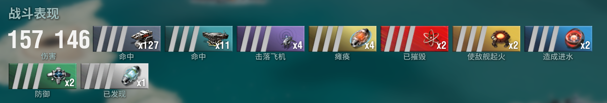

# WoWs EVE Style Ribbons Mod

This mod changes WoWs' standard ribbons images into EVE-based icons.

## How to install

Go to [Github Release](https://github.com/Embers-of-the-Fire/Wows-Eve-Style-Ribbons-Mod/releases) page,
select the latest version, and download the `zip` archive.

Then, after downloading it, unpack the archive and you'll see a folder called `gui` in it.

Copy it to `/path/to/your/wows/bin/<largest number>/res_mods`. If the path doesn't exist, create it.

The result should be like:

```plain
- World of Warships
  - bin
    - 10000 (some random number, previous version)
      - ...
    - 99999 (latest version)
      - res_mods
        - gui        <- the mod lives here
          - ribbons
          - ...
```

## What does this mod changes

The mod overrides large in-game ribbons and smaller ones appearing in the detail list.


